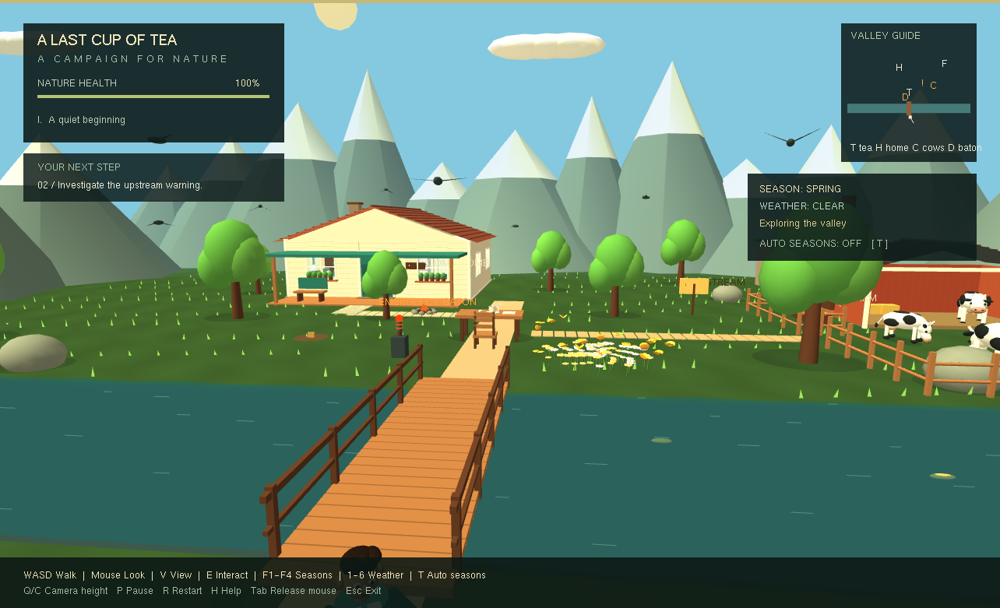
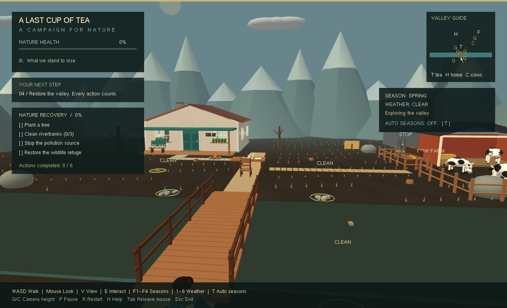
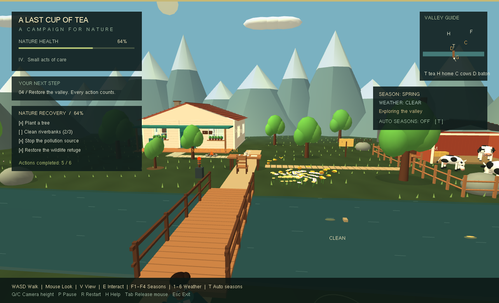
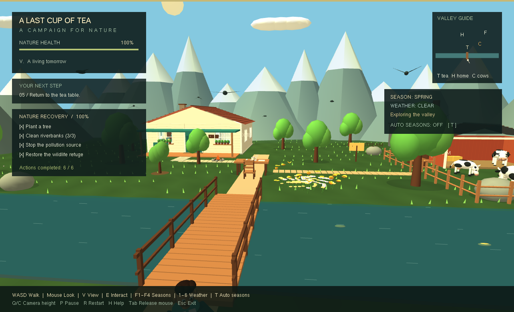
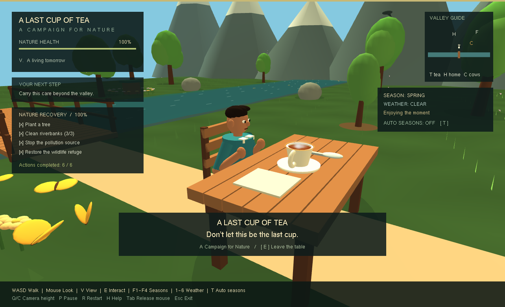
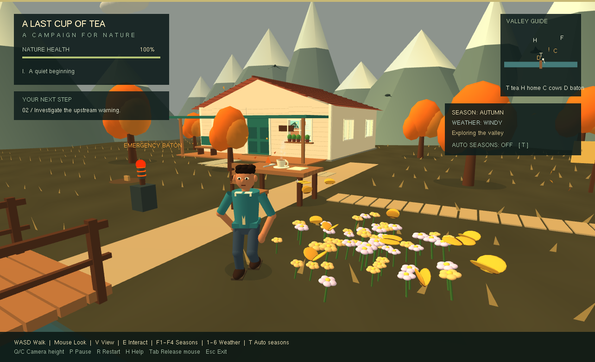
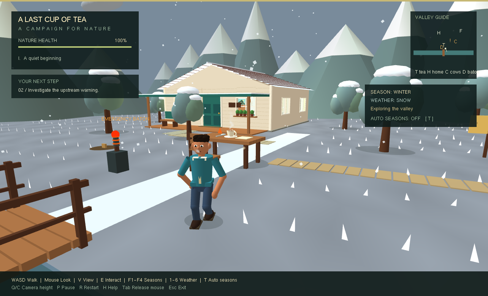
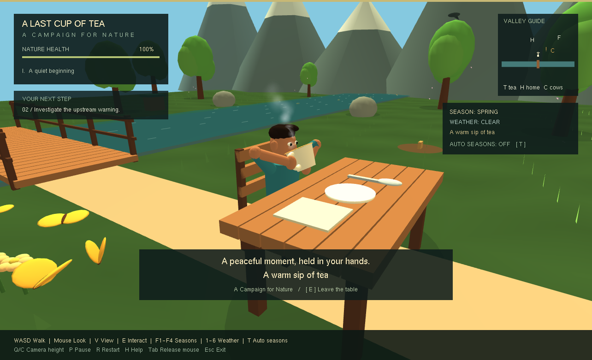
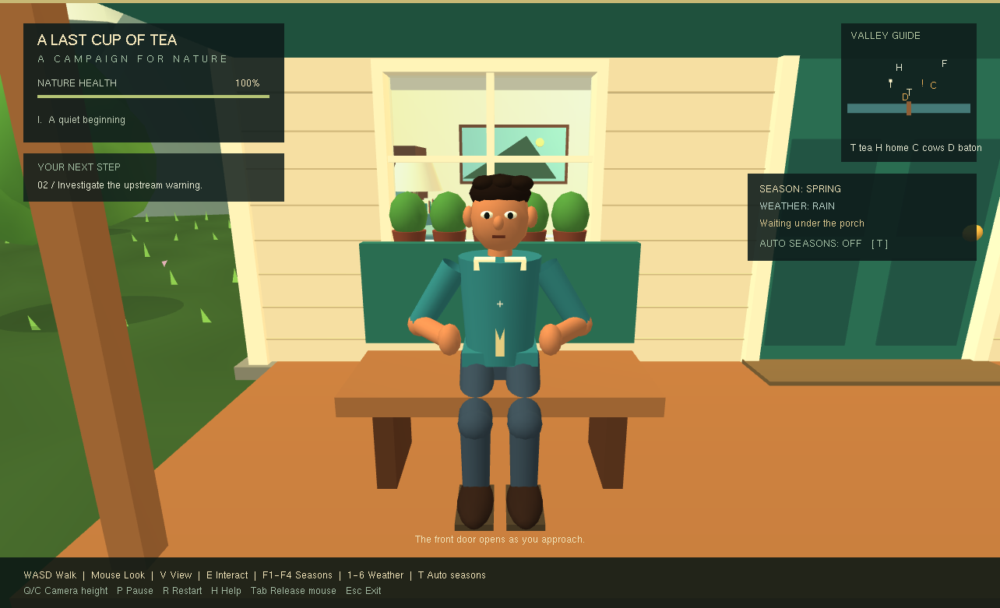
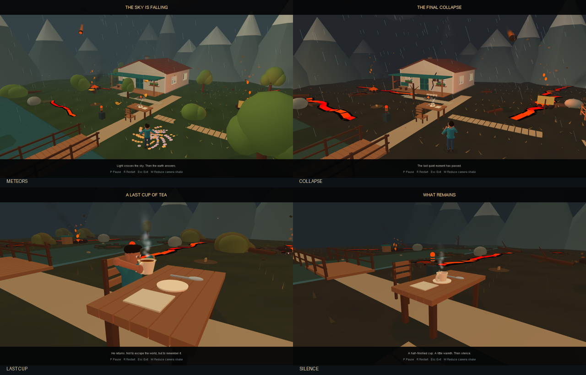

# Build and validation record

Version 4, validated on Windows x64, 21 September 2026.

## Build

- GCC 16.2.0 from w64devkit 2.10.0.
- CMake 3.31.6, Release configuration, C++17.
- Official FreeGLUT 3.6.0 source, statically linked.
- Project source compiled with `-Wall -Wextra -Wpedantic` without compiler warnings.
- FreeGLUT emits a CMake deprecation notice about its older minimum CMake version; configuration and compilation succeed.
- FreeGLUT's optional DLL version resource is omitted from the static library on MinGW, avoiding a resource compiler failure in paths containing spaces.

FreeGLUT archive SHA-256:

```text
9c3d4d6516fbfa0280edc93c77698fb7303e443c1aaaf37d269e3288a6c3ea52
```

## Automated simulation checks

Running `dist/last_cup.exe --self-test` reports:

```text
PASS: 144 campaign, human, weather, home, farm and disaster checks
```

The original campaign checks cover initial state, distance rejection, the first-tea prerequisite, gradual damage, shaking and falling trees, task availability, pause, removed trees, planting, duplicate interaction prevention, recovery limits, all six restoration actions, full restoration, bird recovery, the final tea interaction, reset and forward movement.

New checks cover distance-based walking, idle settling, stopping the gait at collision, character-based interaction, smooth season/weather changes, autumn colours, snow cover, summer wildlife, wet ground, lightning and cooldown, particle pause, snow movement speed, shelter navigation across the bridge, manual override and leaving shelter. A complete tea sequence is sampled over 1,100 updates to check cup-position continuity, hand attachment, safe navigation, pickup and return. Early exit returns the cup safely. Rain arriving during tea waits for the cup to be replaced before sheltering. A separate check confirms changing seasons cannot award recovery progress.

Collision checks cover the table, house, rocks, mountain boundary, trees, river and bridge. A ground-grid flood fill checks that all fifteen interaction points have a collision-free walking approach from the starting area. Interaction distance belongs to the human, so placing the camera close to an object cannot trigger a remote interaction.

CTest reports one test passed and zero failed. The 144 checks run inside that test.

New home and farm checks cover walking through the door in both directions, proximity opening, delayed closing, occupied-door safety, collision-free routes into every room, solid walls and furniture, first-person viewing, remaining indoors during rain, lamp switching, feeding without campaign progress, an accessible farm gate, bounded cow movement, pause and reset. Room-route checks caught a counter blocking the bathroom and a coffee table crowding the door; both layouts were corrected.

## Graphics checks

Running `dist/last_cup.exe --render-check screenshots` creates the actual native OpenGL window, renders thirty-nine deterministic states and saves the framebuffer. Every capture reports `GL_NO_ERROR`. The original five campaign captures remain:

1. Healthy valley.
2. Damaged valley.
3. Recovering valley.
4. Restored valley.
5. Final tea scene.

Eight additional home/farm captures show the enlarged exterior, open doorway, living room, kitchen, bedroom, bathroom, farm and cows. Visual inspection also caught grass protruding through the new bathroom floor; vegetation now excludes the whole home, porch and barn. The campfire was moved clear of the enlarged porch.

The fifteen version-2 captures cover all four seasons, rain, storm lightning, independent snow weather, wind, reach/lift/sip/return stages, shelter, turning and sitting. Images were converted losslessly from PPM to PNG. Visual review led to improved camera clearance around tree crowns, a dedicated shelter camera, softer steam/breath, grounded foot placement and a cup sized for the human. The validation desktop used a 1284 × 781 client area; projection and HUD adjusted to that size.

The version-3 normal-storm baseline was 45.4 average FPS. The version-4 `dist/last_cup.exe --disaster-benchmark` rendered 240 live final-collapse frames at **55.8 average FPS**, with `GL_NO_ERROR`. The scenes have different geometry and effects, so these are not like-for-like performance comparisons. This includes the timer pacing and is a local measurement, not a performance guarantee for other machines.

These captures validate rendering of fixture states. The logic tests separately exercise the campaign through its interaction functions. They do not constitute a manual end-to-end keyboard/mouse playthrough.

## Executable dependencies

The executable imports only Windows system libraries: ADVAPI32, GDI32, GLU32, KERNEL32, msvcrt, OPENGL32, USER32 and WINMM. It does not require a separate FreeGLUT or GCC runtime DLL. A working OpenGL display driver is required.

## Scope and limits

- This is a stylized fixed-function OpenGL graphics-lab project. It does not use physically based rendering, shadow maps, full water reflections or recorded audio.
- Recovery timing is an educational metaphor. Regrowing a forest is deliberately compressed into a short interactive campaign.
- The human stays grounded. Q/C adjusts the following camera; it no longer makes a floating player fly.
- Smoke particles are sorted; transparent objects in general are not handled by a full order-independent transparency system.
- HUD layout targets desktop windows of approximately 1024 × 700 or larger. Extremely small windows may crowd the panels.
- Windows was built and exercised. Linux build instructions are supplied but were not tested on a Linux machine in this session.

## Screenshots




















## Version 4 disaster validation

All 144 checks passed through CTest. The full disaster story is advanced through the actual baton interaction, not by assigning its end state. Checks cover distance and pause gating, duplicate activation, cinematic weather ownership, ordered progression through every phase, collision-free continuous escape and return, running and head-covering reactions, hand/cup attachment, the slow final sip, safe cup replacement, repeated meteor impacts, final fade, bounded storage, stable tea/home ground, pause, reduced camera shake, reset, safe meteor target selection and accelerating flight. The six original recovery objective counters remain unchanged.

The native renderer captured 39 scenes with GL_NO_ERROR. Disaster scenes 29-39 show the opening tea, warning, earthquake, lava, a visible descending meteor, storm, ruins, last sip, final collapse, abandoned cup and final darkness. These fixtures use a fixed random seed and advance the same update functions as the game. A camera adjustment keeps the first meteor readable; later impact positions remain randomized in normal play.

The original house/farm and campaign render fixtures were recaptured with the new build. No manual end-to-end keyboard/mouse playthrough is claimed; input gating, animations and navigation were exercised by the deterministic logic tests, and framebuffer captures were visually reviewed.




## Fast-forward shortcut

F cycles disaster playback through 1x, 4x and 8x. The update loop subdivides accelerated time into steps of at most 1/60 second. Eight additional checks cover normal-play isolation, both speed settings, measured 4x time advance, pause, a complete collision-free 8x story with both final cup events within 30 seconds of simulated real time, returning to 1x and restart reset. The earlier 39 rendering captures and benchmark record the base disaster release; this shortcut update changes the title/control text and simulation scheduling.
